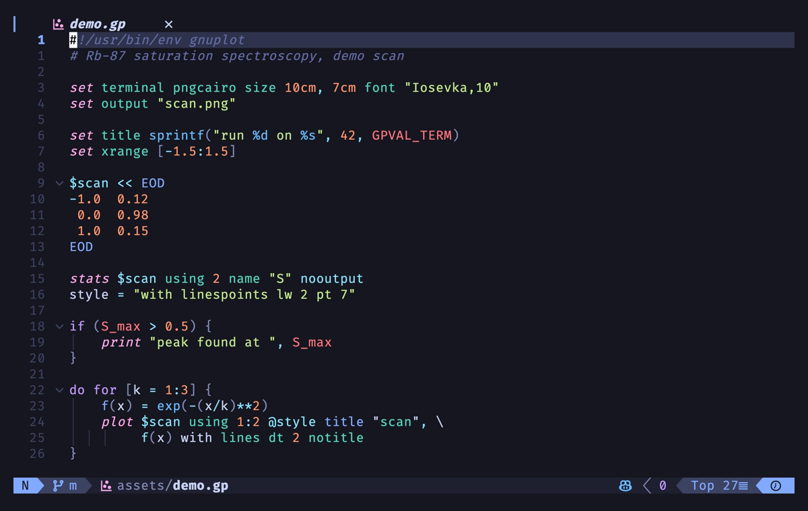

# gnuplot.vim

[](https://github.com/dpezto/gnuplot.vim/actions/workflows/ci.yml)
[](https://codecov.io/gh/dpezto/gnuplot.vim)
[](https://github.com/dpezto/gnuplot.vim/releases/latest)
[](.github/CONTRIBUTING.md)



Syntax highlighting for [gnuplot](http://www.gnuplot.info) 6 scripts that
matches the colours of the
[tree-sitter-gnuplot](https://github.com/dpezto/tree-sitter-gnuplot) grammar.
Both projects generate their keyword lists from the same 794-word dictionary,
and under Neovim every syntax group links to the treesitter capture the
grammar's own queries use, so a buffer highlighted by this plugin and one
highlighted by the grammar take identical colours from your colorscheme.
Measured over a representative script, the two agree on 92.5% of the
characters they both highlight.

## Features

- One dictionary, two engines: the keyword lists are generated from
  `keywords.json`, a pinned copy of the dictionary the grammar emits, and a
  weekly job opens a PR when the grammar moves.
- Same colours as tree-sitter: on Neovim the groups link to captures such as
  `@keyword`, `@variable.member` and `@constant`; on Vim they fall back to the
  classic groups (`Statement`, `Identifier`, `Constant` and so on).
- gnuplot abbreviations for the near-universal forms: `p[lot]`, `sp[lot]`,
  `rep[lot]`, `t[erminal]`, `o[utput]`, `u[sing]`, `w[ith]`, `tit[le]`,
  `not[itle]`, `l[ines]`, `p[oints]` and `linesp[oints]`.
- Covers commands, set/show options and their suboptions, toggles, enumerated
  values, plot styles, plot-element modifiers, terminal names, built-in
  functions and variables, datablocks, macros, numbers with unit suffixes,
  and both string flavours.
- Sensible buffer-local editor settings (comments, `iskeyword`,
  `matchpairs`), all undone by `b:undo_ftplugin`.
- No commands, no mappings, no global options. Nothing to configure.
- Pure Vim script.

## Requirements

- Neovim 0.7 or newer, or Vim 8 or newer.
- Node.js is only needed by contributors who regenerate the syntax file.

## Install

Standard runtime path layout, so any plugin manager works. With
[lazy.nvim](https://github.com/folke/lazy.nvim):

```lua
{ "dpezto/gnuplot.vim" }
```

With [vim-plug](https://github.com/junegunn/vim-plug):

```vim
Plug 'dpezto/gnuplot.vim'
```

Or as a native package:

```sh
git clone https://github.com/dpezto/gnuplot.vim \
  ~/.vim/pack/plugins/start/gnuplot
```

No configuration is needed. `:help gnuplot` documents everything below.

## What it recognises

### Detection

The filetype is set for the extensions `.gnu`, `.gnuplot`, `.gpi`, `.plot`
and `.plt`, for the files `gnuplotrc` and `.gnuplot`, and (on the Vim side)
for any file whose first line is a shebang naming gnuplot.

`.gp` is left to PARI/GP, which owns it in the stock Vim and Neovim runtimes.
To claim it anyway, add to your own config:

```lua
-- Neovim
vim.filetype.add({ extension = { gp = "gnuplot" } })
```

```vim
" Vim
autocmd BufNewFile,BufRead *.gp set filetype=gnuplot
```

### Coverage

Highlighting covers commands, set/show options and their suboptions, toggles,
enumerated values, plot styles, plot-element modifiers, terminal names, the
built-in function and variable sets, datablocks, macros, numbers with unit
suffixes, and both string flavours.

gnuplot lets most keywords be shortened, and the generated lists spell that
as `p[lot]`, which is `:syn-keyword`'s own notation for an optional tail, so
an abbreviation costs no regular expression at all. Which keywords may appear
short is a deliberate choice rather than the full set; see
[Limitations](#limitations).

## Editor settings

The ftplugin sets a few buffer-local options:

- `commentstring=# %s` and `comments=:#`, so commenting plugins and `gq` know
  the comment leader.
- `formatoptions-=t` and `formatoptions+=croql`: comments wrap and continue,
  code does not auto-wrap.
- `iskeyword+=_`, because gnuplot identifiers and its built-in variables
  (`GPVAL_TERM`, `STATS_mean_y`) contain underscores.
- `matchpairs+=<:>`, so `%` jumps between the brackets in
  `set xrange [0:1]` style pairs.

All of it is registered in `b:undo_ftplugin`, so `:setfiletype` away from
gnuplot restores your defaults.

## Highlight groups

Every group is defined with `hi def link`, once for Neovim (treesitter
captures) and once for Vim (classic groups):

```
group                   Neovim capture               Vim fallback
gnuplotCommand          @keyword                     Statement
gnuplotOption           @variable.member             Identifier
gnuplotFlag             @keyword.directive           PreProc
gnuplotValue            @constant                    Constant
gnuplotAttribute        @property                    Structure
gnuplotStyle            @attribute                   Type
gnuplotStyleVariable    @variable.parameter          Special
gnuplotConditional      @keyword.conditional         Conditional
gnuplotRepeat           @keyword.repeat              Repeat
gnuplotConnector        @keyword.function            Function
gnuplotColorName        @variable.parameter.builtin  Constant
gnuplotPseudoElement    @keyword                     Statement
gnuplotShell            @keyword                     Statement
gnuplotComment          @comment                     Comment
gnuplotTodo             @comment.todo                Todo
gnuplotString           @string                      String
gnuplotEscape           @string.escape               SpecialChar
gnuplotFormat           @string.special              SpecialChar
gnuplotDatablock        @string                      String
gnuplotDatablockName    @label                       Label
gnuplotDatablockRef     @module                      Identifier
gnuplotColumnRef        @variable.parameter          Special
gnuplotMacro            @function.macro              Macro
gnuplotNumber           @number                      Number
gnuplotConstant         @constant.builtin            Constant
gnuplotBuiltinVar       @variable.builtin            Identifier
gnuplotFunction         @function.call               Function
gnuplotBuiltinFunction  @function.builtin            Function
gnuplotOperator         @operator                    Operator
gnuplotKeywordOperator  @keyword.operator            Operator
gnuplotBracket          @punctuation.bracket         Delimiter
gnuplotWildcard         @character.special           Special
```

Neovim ships default highlights for every standard capture, so the treesitter
side works with no parser installed. To restyle a group, override the link
after your colorscheme loads:

```vim
autocmd ColorScheme * hi link gnuplotStyle Special
```

## Limitations

Vim keywords carry no context, so a word meaning two things in gnuplot gets
one colour. `p` starts a plot command and also names the `points` style; the
command wins. `f` is the `fit` command, so in `f(x) = x**2` the `f` reads as
a command rather than a function definition.

Abbreviations are opt-in. Honouring every one of gnuplot's would make most
single letters keywords (fifty-one reduce to one character), so `a = 42` and
a loop counter would light up. Only the near-universal forms are abbreviated,
which is why `set xr` is not highlighted.

Two deliberate differences from the grammar: a datablock body is inert here
(the grammar highlights its contents), and `!` marks only the shell escape
itself, since Vim cannot inject bash into the rest of the line.

## Development

```sh
npm run gen:syntax                          # regenerate from keywords.json
npm run check:syntax                        # fail if the committed file is stale
nvim --headless -u NONE -S tests/run.vim    # run the assertions
```

Only the block between the generated markers in `syntax/gnuplot.vim` is
machine written; the rest of the file is hand maintained. New keywords arrive
on their own: a weekly job compares the vendored `keywords.json` against
tree-sitter-gnuplot and opens a PR when it has moved. The screenshot above is
recorded with `vhs assets/hero.tape`.

See [CONTRIBUTING](.github/CONTRIBUTING.md) for the full workflow.

<details>
<summary>Upgrading from the pre-1.0 plugin</summary>

1.0.0 is a ground-up rewrite. The repository was never tagged before it, so
every plugin manager was tracking `main` directly and picks the rewrite up as
an ordinary update. Three things change for anyone who had the old version:

- Highlight groups were all renamed. The old file defined `gnuCmd`, `gnuVar`,
  `gnuNumber`, `gnuDef` and a per-command family (`setOpt`, `pltOpt`,
  `fitOpt`, `set_arroOpt` and so on). None of those exist now; the groups are
  the `gnuplot*` names above. A colourscheme or `highlight` override
  targeting an old name silently stops applying.
- `.gp` and `.pal` are no longer claimed. `.gp` belongs to PARI/GP in the
  stock Vim and Neovim runtimes, and detection now yields to it. Add your own
  `autocmd` if you want either extension back.
- Abbreviations are opt-in. The old file matched many shortened keywords;
  only the near-universal ones are honoured now, so `set xr` no longer
  highlights. See [Limitations](#limitations) for why.

</details>

## Credits

A ground-up rewrite following earlier work by
[James Eberle](https://www.vim.org/scripts/script.php?script_id=1737) and
[Andrew Rasmussen](https://www.vim.org/scripts/script.php?script_id=4873).

## License

[MIT](LICENSE)
